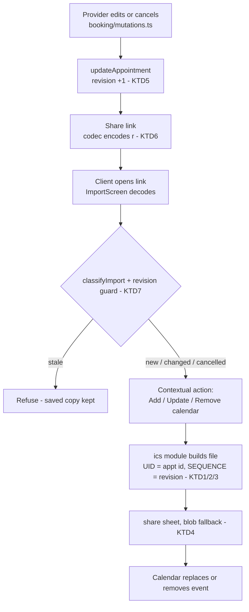

# Calendar Integration (.ics) - Plan

## Goal Capsule

- **Objective:** A client who receives an appointment link gets a reminder that actually fires — in their own calendar app, with no install and no account — and that reminder stays correct when the appointment is rescheduled or cancelled.
- **Means:** Client-side `.ics` generation in a new pure leaf module, delivered share-sheet-first (KTD4), with a revision-driven `SEQUENCE` (KTD5, KTD6) so re-imports replace rather than duplicate. Closes epic #8.
- **Authority:** User decisions > this plan > repo conventions (CLAUDE.md, CONTEXT.md). The Product Contract's R-IDs own product behavior; KTDs own implementation mechanism within them.
- **Stop conditions:** If the U2 device validation shows the **create** flow failing on either target platform, stop and surface — the feature's premise is wrong. Update/cancel failures on iOS do not stop the work; KTD9's fallback covers them.
- **Tail ownership:** Executor runs the Verification Contract gates and the U2 manual checklist; results are recorded in the PR.

---

## Product Contract

Product Contract preservation: content unchanged; the brainstorm's Outstanding Questions section is resolved in place (module placement → KTD1, VTIMEZONE → KTD2, UI copy → U4/U5, Google template fallback → Scope Boundaries contingency).

### Summary

Add an "Add to calendar" action to the client-side import landing screen and the saved appointment card. It produces an `.ics` event pinned to the salon's timezone, with day-before and hour-before alarms and a re-import link in the description. A new monotonic revision on the handoff payload and the `received` store drives the `.ics` `SEQUENCE`, making reschedule and cancellation propagate correctly when the client opens a newer link.

### Problem Frame

The README promises "One tap adds it to your calendar, and the calendar reminds you" — and no `.ics` code exists anywhere in the app. This is the product's only reminder mechanism: scheduled local web notifications are dead as a platform capability (Google abandoned the Notification Triggers API with no replacement), and web push requires install, permission, and iOS 16.4+. Calendar handoff is the one reminder path that works for a client who installs nothing.

The gap is sharper than a missing button. A reshared link already overwrites the client's saved card in place, so once a calendar entry exists, a reschedule that updates the card but not the calendar leaves the client's calendar showing the old time while the app shows the new one — a silent divergence worse than no calendar entry at all.

### Key Decisions

- KD1. **Client-side button, not provider-side file share.** The action lives where every client already passes: the import landing screen, plus the saved card. (session-settled: user-directed — chosen over attaching the `.ics` to the provider's share sheet: file+link shares behave inconsistently across messengers; the landing button is one tap and works in any browser.) Governs R1, R2.
- KD2. **Full lifecycle in v1, which pulls the revision field into scope.** (session-settled: user-directed — chosen over create-only: without a revision, `SEQUENCE` is stuck at 0 and a reschedule can silently strand the old time in the client's calendar.) Governs R5, R6, R7, R8.
- KD3. **Event time pinned to the salon's IANA timezone.** (session-settled: user-directed — chosen over floating wall-clock time: the alarm fires at the true physical moment for a travelling client; same-city clients see no difference.) Governs R4.
- KD4. **The event description carries the re-import link.** The calendar entry doubles as a recovery artifact. (session-settled: user-directed — chosen over a plain description: marginal exposure beyond what any calendar entry already sends to the calendar provider, in exchange for a real recovery path.) Governs R9, R10.
- KD5. **Two alarms: day before and hour before.** (session-settled: user-directed — chosen over a single alarm.) Governs R3.

### Requirements

**Calendar capture**

- R1. The import landing screen and the saved appointment card in client home each offer an "Add to calendar" action that hands the client's calendar app an `.ics` event for the appointment.
- R2. The action works in any modern mobile browser with no install and no account; where the browser cannot open the file directly, it falls back to a plain file download.
- R3. The event carries two reminders: 24 hours and 1 hour before the appointment start.
- R4. The event start is the appointment's wall-clock time pinned to the provider's IANA timezone from the payload; the event names the provider and service, and carries the address as the event location when present.

**Lifecycle and revision**

- R5. The handoff payload and the `received` store carry a monotonic per-appointment revision, added as an additive wire key with no schema-version bump; import never applies an older revision over a newer stored one.
- R6. The `.ics` UID is stable, derived from the appointment id; `SEQUENCE` derives from the revision, so importing a newer event replaces the existing calendar entry instead of duplicating it.
- R7. A cancelled appointment emits `STATUS:CANCELLED` with a higher `SEQUENCE`, so importing it removes or voids the calendar entry.
- R8. When an incoming payload supersedes or cancels an appointment already saved on the device, the import screen says so and leads with the matching calendar action — update or remove — instead of a generic add.

**Recovery and disclosure**

- R9. The event description contains the appointment's re-import fragment link, so the calendar entry alone can restore the record on a new device.
- R10. The UI states in one plain sentence, in English and Bulgarian, that the calendar event contains a link back to the appointment.

### Key Flows

- F1. First capture
  - **Trigger:** Client opens a share link.
  - **Steps:** Import landing shows the appointment; client taps "Add to calendar"; the calendar app imports the event with both alarms.
  - **Outcome:** A reminder exists before the client has saved anything in the app. **Covers R1, R2, R3, R4.**
- F2. Reschedule
  - **Trigger:** Provider changes the time and reshares; client opens the new link.
  - **Steps:** Import detects a newer revision of a saved appointment; screen leads with "Update your calendar"; the imported event replaces the old one via same UID, higher `SEQUENCE`.
  - **Outcome:** Card and calendar agree on the new time. **Covers R5, R6, R8.**
- F3. Cancellation
  - **Trigger:** Provider cancels and reshares; client opens the link.
  - **Steps:** Import detects the cancellation; screen leads with "Remove from calendar"; the `.ics` carries `STATUS:CANCELLED` with a higher `SEQUENCE`.
  - **Outcome:** The stale reminder is gone. **Covers R7, R8.**

### Acceptance Examples

- AE1. **Covers R5.** Given a saved appointment at revision 3, when a link carrying revision 2 of the same appointment is opened, then the saved copy is unchanged and the screen says the link is out of date.
- AE2. **Covers R6, R8.** Given a client whose calendar holds the event at revision 1, when they open a revision-2 link and accept the calendar update, then their calendar shows exactly one event for the appointment, at the new time.
- AE3. **Covers R4.** Given a salon in Sofia and a client whose phone is set to London time, when the client imports the event, then the alarm fires at the true moment of the appointment (Sofia wall-clock), whatever time label their calendar displays.
- AE4. **Covers R9.** Given a client with a new phone and nothing but their calendar, when they open the link in the event description, then the appointment appears on the import screen ready to save.

### Success Criteria

- Real-device validation on Google Calendar (Android) and Apple Calendar (iOS) for all three flows — create, replace-on-reschedule, cancel — runs as the U2 gate before the UI work ships; results recorded in the PR.
- E2E specs cover F1–F3; unit tests cover `.ics` serialization and revision comparison.
- The README's calendar promise is true as written.

### Scope Boundaries

- Provider-side `.ics` file sharing via the share sheet — chosen against for v1 (KD1).
- Any other reminder channel (SMS/WhatsApp nudges, web push) — separate ideation candidates, not this plan.
- Provider-side export of a day or week of their own schedule — out.
- What keeps the client PWA worth reopening once the calendar carries the reminder (the "lifelong visit record" idea) — deliberately deferred to a later brainstorm.
- Desktop Outlook compatibility — explicit non-goal (consequence of KTD2; Outlook is strict about `VTIMEZONE`).

#### Deferred to Follow-Up Work

- A Google-specific `calendar.google.com/render?action=TEMPLATE` deep link as a create-only convenience — cannot participate in the UID/SEQUENCE model (Google mints its own UID; no alarms parameter); add only if U2 shows Google's `.ics` flow needs it.

### Dependencies / Assumptions

- **Assumption, downgraded by research and gated by U2:** calendar clients replace an event on re-import of the same UID with a higher `SEQUENCE`. Google Calendar's behavior is decently corroborated by practitioner reports (2025). **iOS is the weak link:** Apple developer forum threads (2023, 2025) document silent failures — Calendar rewriting a supplied UID, and iOS Safari's "Add All" going unresponsive on a second file. U2 validates on real devices; KTD9's fallback covers an iOS silent no-op.
- **Accepted degradation:** Google Calendar may ignore embedded `VALARM`s on import and apply the user's default reminders instead; Apple Calendar honors them. The client still gets a reminder if they have defaults; ours are guaranteed only on Apple.
- **Verified:** the handoff codec ignores unknown wire keys, so the revision ships without a version bump (`src/modules/handoff/codec.ts:38`); the `received` store has no revision field (`src/modules/received/received.ts`); no `.ics` code exists in `src/`; all appointment mutations flow through `src/modules/booking/mutations.ts` → `updateAppointment`.

### Sources

- `docs/ideation/2026-08-18-open-ideation.html` — the ideation this work develops (idea 1), including verification notes.
- Epic #8 (`gh issue view 8`) — original scope wording this plan supersedes in shape.
- `docs/specs/2026-08-10-handoff-payload-qr-import-design.md` §7 — the wall-clock display rule KD3 interprets for alarms.
- RFC 5545 (`VTIMEZONE`, folding, escaping), RFC 5546 (iTIP `METHOD` semantics).
- Apple Developer Forums threads 772082 (2025) and 734647 (2023) — iOS same-UID re-import failures (KTD9's basis).
- caniuse `navigator.share` files parameter — ~92% global, iOS 14+/Android full (2026 data).
- adamgibbons/ics on GitHub — mainstream library supports UTC/floating only (KTD8's basis).

---

## Planning Contract

### Key Technical Decisions

- KTD1. **`.ics` generation lives in a new pure leaf module `src/modules/ics/`.** Two consumers exist from day one (`handoff`'s import screen, `shell`'s card), which meets the repo's promote-on-second-consumer rule; the module is a pure formatter shaped like `time` (no Dexie, no UI), so both consumers import it without cycles. (session-settled: user-approved — chosen over extending `handoff` or `shell`: either would force the other to import a screen module for a formatter.)
- KTD2. **Bare IANA `TZID`, no embedded `VTIMEZONE` component.** Google and Apple Calendar resolve standard IANA names without the block (practitioner evidence, 2025–26); hand-building DST rule tables is the highest-risk part of a serializer; the mainstream `ics` library ships no VTIMEZONE support at all. Desktop Outlook strictness is accepted as a non-goal. (session-settled: user-approved — chosen over embedding VTIMEZONE or UTC-converting DTSTART, which breaks the wall-clock rule under DST.) Governs R4.
- KTD3. **`METHOD:PUBLISH` on every file — initial, update, and cancellation.** `METHOD:REQUEST` triggers attendee RSVP UI; `METHOD:CANCEL` is specified for organizer/attendee iTIP exchanges this app does not have. Cancellation is `PUBLISH` + `STATUS:CANCELLED` + higher `SEQUENCE` (per R7).
- KTD4. **Delivery is share-sheet-first: `navigator.canShare({files})` → `navigator.share` with a `text/calendar` File inside the click handler; fallback is a synchronous Blob + `<a download>` click.** Share gives one-tap Calendar targeting on iOS 14+ and Android (~92% support); the fallback mirrors the backup module's download pattern. iOS constraint: the trigger must run synchronously in the user-gesture handler — an awaited Blob-URL click is silently dropped. (session-settled: user-approved — chosen over download-first.) Governs R1, R2.
- KTD5. **The revision bumps inside `updateAppointment` itself, unconditionally.** The caller already passes the full current object, so the bump needs no extra read; putting it in the store function covers both existing call sites (edit and cancel in `booking/mutations.ts`) and every future one. `addAppointment` seeds revision 0. `replaceAllAppointments` (backup restore) preserves stored revisions untouched. A no-op edit re-issues an identical event — harmless. (session-settled: user-approved — chosen over caller-computed bumps, which every future mutation site must remember.) Governs R5.
- KTD6. **Revision is an optional additive field everywhere: `revision?: number` on `Appointment` and `ReceivedAppointment`, wire key `r?`.** Not indexed, so no Dexie version bump (follows the `providerId` precedent in the same store); the codec ignores unknown keys, so no `SCHEMA_VERSION` bump (follows the `k`/`f` precedent). A payload without `r` reads as revision 0. Governs R5, R6.
- KTD7. **`classifyImport` keeps its field-based outcomes; revision adds one guard and one output.** The existing `'new' | 'changed' | 'cancelled' | 'upToDate'` classification already answers R8's display question without revisions. Revision adds a `'stale'` outcome (incoming revision lower than stored → refuse, per R5/AE1) and is otherwise consumed only by the `.ics` layer as `SEQUENCE`.
- KTD8. **Hand-rolled serializer, ~150 lines, unit-tested against the RFC checklist.** The mainstream `ics` package supports only UTC/floating time — incompatible with KTD2/KD3 — and the checklist (CRLF, 75-octet folding without splitting multi-byte codepoints, escape order `\` `;` `,` newline, `DTSTAMP`, `PRODID`) is testable directly.
- KTD9. **iOS silent-failure fallback: after an update or cancel import, the screen shows one guidance line — if the calendar did not change, remove the old event and add this one.** The observed iOS failure mode is a silent no-op, not a catchable error, so UX guidance is the only available mitigation. (session-settled: user-approved — part of the confirmed risk-flip call-out.) Governs R8's update/remove actions.

### High-Level Technical Design

Directional guidance, not implementation specification.

---

## Implementation Units

### U1. `ics` leaf module: serializer and filename helper

- **Goal:** A pure function that turns an appointment-shaped input into a spec-correct `.ics` string, plus a filename helper.
- **Requirements:** R3, R4, R6, R7, R9. KTD1, KTD2, KTD3, KTD8.
- **Dependencies:** none.
- **Files:** `src/modules/ics/ics.ts`, `src/modules/ics/index.ts`, `src/modules/ics/ics.test.ts`.
- **Approach:** Input is a plain object (id, provider name, address?, service, `WallClock` start, duration, status, revision, re-import URL) — no Dexie, no module imports beyond `time`'s `WallClock` type. Emit per KTD2/KTD3; two `VALARM`s (-P1D, -PT1H); `DESCRIPTION` carries the re-import URL per KD4.
- **Patterns to follow:** module shape of `src/modules/time/`; filename-helper convention of `src/modules/shell/backupFile.ts`.
- **Execution note:** Implement test-first against the RFC checklist — the serializer's failure mode is silent rejection by calendar apps, so the tests are the spec.
- **Test scenarios:**
  - Happy path: booked appointment yields VCALENDAR with VERSION, PRODID, METHOD:PUBLISH, one VEVENT with UID `<id>@when-again`, `SEQUENCE` equal to revision, `DTSTART;TZID=Europe/Sofia:...` matching the wall-clock digits, DTSTAMP present, both VALARMs.
  - Cancelled appointment yields `STATUS:CANCELLED` and the given (higher) SEQUENCE.
  - Missing revision serializes as `SEQUENCE:0`; missing address omits LOCATION.
  - Escaping: service name containing `,` `;` and a newline round-trips escaped; description URL is not mangled.
  - Folding: a line exceeding 75 octets folds with leading-space continuation; a multi-byte Cyrillic name never splits a codepoint across the fold.
  - Every line ends CRLF, including the last.
- **Verification:** unit tests pass; a generated sample opens as a valid event in at least one desktop calendar app during development.

### U2. Real-device validation gate

- **Goal:** Kill or confirm the re-import assumption on real devices before the UI ships; record the results.
- **Requirements:** Success Criteria (device validation); the Dependencies/Assumptions entry it gates. Covers AE2, AE3 manually.
- **Dependencies:** U1.
- **Files:** `docs/design/ics-device-validation.md` (checklist + results), `src/modules/ics/fixtures/` (three committed sample files: create, revision-2 update, cancel).
- **Approach:** Generate the three fixtures with U1's serializer. On a real Android phone (Google Calendar) and a real iPhone (Apple Calendar): import create; import update — verify replace-not-duplicate; import cancel — verify removal or visible cancellation. Record per-platform outcomes in the checklist doc.
- **Execution note:** This is a hard gate for U4/U5's copy decisions: an iOS silent no-op on update confirms KTD9's guidance line is load-bearing; a create-flow failure on either platform is a plan stop condition (Goal Capsule).
- **Test scenarios:** Test expectation: none — manual validation unit; the checklist doc is the artifact.
- **Verification:** checklist committed with all three flows recorded per platform.

### U3. Revision field: stores, mutations, wire

- **Goal:** The monotonic revision exists end-to-end: seeded on create, bumped on every provider mutation, carried in the payload, defaulted on legacy data.
- **Requirements:** R5, R6. KTD5, KTD6.
- **Dependencies:** none (parallel with U1).
- **Files:** `src/modules/appointments/appointments.ts`, `src/modules/appointments/appointments.test.ts`, `src/modules/received/received.ts`, `src/modules/received/received.test.ts`, `src/modules/handoff/codec.ts`, `src/modules/handoff/codec.test.ts`, `src/modules/handoff/HandoffShare.tsx`, `src/modules/booking/ShareLanding.tsx`.
- **Approach:** Per KTD5 and KTD6. Wire the value through `HandoffShare`'s input the same way `providerId`/`phone` travel today. Decode validates `r` as an optional number and defaults absent to 0.
- **Patterns to follow:** additive-optional-field precedent (`providerId` in `received.ts`); additive wire-key precedent (`k`/`f` in `codec.ts:38`).
- **Test scenarios:**
  - `addAppointment` seeds revision 0; `updateAppointment` bumps 0→1→2 across successive edits; cancel via the mutations path bumps too.
  - `replaceAllAppointments` restores records with their stored revisions unchanged.
  - Codec round-trip preserves `r`; decoding a payload without `r` yields revision 0; a non-numeric `r` is rejected as malformed.
  - Old-payload compatibility: an encoded v1 payload without `r` still decodes (guards unchanged for absent key).
- **Verification:** unit suites for `appointments`, `received`, `handoff` pass; existing tests unaffected.

### U4. Import screen: stale guard and contextual calendar actions

- **Goal:** The import screen refuses stale links and leads with the right calendar verb when superseding or cancelling.
- **Requirements:** R5, R8. AE1. KTD7, KTD9.
- **Dependencies:** U1, U3. U2 informs final copy.
- **Files:** `src/modules/handoff/classify.ts`, `src/modules/handoff/classify.test.ts`, `src/modules/handoff/ImportScreen.tsx`, `src/modules/handoff/strings.ts`, `src/modules/handoff/strings.test.ts`.
- **Approach:** Extend `classifyImport` with the `'stale'` outcome per KTD7 (checked before field comparison). The screen's existing `outcome.kind` branch gains: stale → refusal message, no save action; changed → "Update your calendar" as the calendar action label; cancelled → "Remove from calendar". Post-action guidance line per KTD9. All new strings in EN and BG.
- **Patterns to follow:** existing `classifyImport` outcomes and the screen's title/action branching; per-module strings convention with key-parity test.
- **Test scenarios:**
  - Covers AE1. incoming revision 2 vs stored 3 → `'stale'`; store unchanged; refusal copy shown.
  - Equal revision, identical fields → `'upToDate'` (unchanged behavior); equal revision, different fields → `'changed'` (field comparison still decides).
  - Cancelled incoming → `'cancelled'` regardless of revision, provided not stale.
  - Strings: BG/EN key parity holds with the new keys.
- **Verification:** `handoff` unit suite passes; manual walkthrough of stale/changed/cancelled imports in dev.

### U5. "Add to calendar" buttons and delivery

- **Goal:** One tap on the import landing or the saved card hands the event to the calendar app.
- **Requirements:** R1, R2, R3, R4, R9, R10. KD1, KD4, KTD4.
- **Dependencies:** U1, U3; U2's platform findings for copy.
- **Files:** `src/modules/handoff/ImportScreen.tsx`, `src/modules/shell/ClientHome.tsx`, `src/modules/shell/strings.ts`, `src/modules/shell/strings.test.ts`, plus the button component in its first-consumer module per repo rule (promote later if duplicated).
- **Approach:** Build the `.ics` via U1 from the record already in scope (`NextVisitCard`'s `visit` has every needed field; the import screen has the decoded payload). Delivery per KTD4: `canShare` → `share` with a `File`, else the backup module's synchronous blob-anchor pattern including the deferred `revokeObjectURL`. Disclosure line per R10 near the button.
- **Patterns to follow:** `src/modules/shell/BackupSection.tsx` download function (deferred revoke is a documented WebKit hazard); strings convention.
- **Test scenarios:**
  - Button renders on the import landing for a decodable payload and on the saved card; hidden for stale outcome.
  - Fallback path: with `navigator.share` absent, tapping creates and clicks a `text/calendar` blob anchor (assert via DOM/jsdom spies).
  - Error path: `navigator.share` rejecting (user dismisses the share sheet) resolves quietly — no error state, no false success confirmation.
  - Disclosure line present in both locales; key parity holds.
  - Covers AE4 at unit level: the generated DESCRIPTION contains the exact re-import URL for the payload.
- **Verification:** unit suites pass; manual tap-through on desktop + one mobile browser in dev.

### U6. E2E coverage and download-content assertion infra

- **Goal:** The three flows are provable in CI, including the actual bytes of the generated file.
- **Requirements:** Success Criteria (e2e covers F1–F3). Covers AE1, AE2 (app-side half), AE4.
- **Dependencies:** U4, U5.
- **Files:** `e2e/calendar.spec.ts`, `e2e/helpers.ts`.
- **Approach:** Follow `e2e/handoff.spec.ts`'s provider→share→import round-trip shape. New infra: intercept the generated file content via `page.evaluate` around the blob creation (or a test hook that exposes the serialized string), since no existing e2e asserts downloaded-file contents. Assert UID stability, SEQUENCE increment across a reshare, VALARM count, `STATUS:CANCELLED` on the cancel flow, and the stale-link refusal screen.
- **Patterns to follow:** `gotoAsProvider` helper; fragment-decoding approach already used in `e2e/handoff.spec.ts`.
- **Test scenarios:**
  - Covers F1/AE4: import a fresh link, trigger the button, captured `.ics` has UID `<id>@when-again`, SEQUENCE 0, two VALARMs, DESCRIPTION containing the import URL.
  - Covers F2/AE2: edit + reshare + reimport → screen leads with update; captured file has same UID, SEQUENCE 1.
  - Covers F3: cancel + reshare + reimport → "Remove from calendar"; file carries `STATUS:CANCELLED`.
  - Covers AE1: open the older link after the newer → refusal screen, stored row unchanged.
- **Verification:** `npm run test:e2e` green in CI.

---

## Verification Contract

| Gate | Command | Applies to |
|---|---|---|
| Lint | `npm run lint` | all units |
| Format | `npm run format:check` | all units |
| Types | `npm run typecheck` | all units |
| Unit tests | `npx vitest --run` | U1, U3, U4, U5 |
| E2E | `npm run test:e2e` | U6 |
| Device checklist | manual, per `docs/design/ics-device-validation.md` | U2 gate; recorded in PR |

CI runs the first five in this order (`.github/workflows/ci.yml`); all must be green.

---

## Definition of Done

- All six units complete; every gate in the Verification Contract passes.
- U2's checklist is committed with per-platform results for create, update, and cancel.
- The stale-link, update, and cancel paths are visible in the UI with EN and BG copy.
- No dead experimental code from abandoned serializer or delivery attempts remains in the diff.
- The README's calendar sentence is accurate with no wording change needed.
